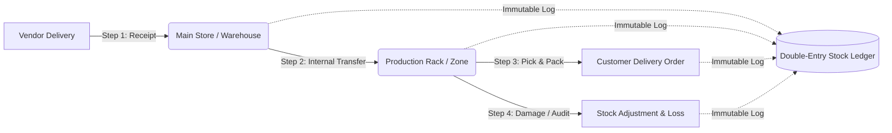

# 📦 StockSense — Intelligent Modular Inventory Management System (IMS 2.0)

[](https://stock-lake-five.vercel.app)
[](https://www.mongodb.com/)
[](https://stock-lake-five.vercel.app)
[](https://www.typescriptlang.org/)
[](https://reactjs.org/)
[](https://vitejs.dev/)
[](https://tailwindcss.com/)
[](https://www.odoo.com/)

> 🌐 **Live Production Application**: [**https://stock-lake-five.vercel.app**](https://stock-lake-five.vercel.app)  
> 🍃 **Cloud Database**: MongoDB Atlas Integration (`stocksense`) with automated sync  
> 📱 **Authentication**: Real-Time SMS Phone OTP via Verix Gateway API  
>
> **StockSense** is a modular, real-time Inventory Management System (IMS) designed to replace manual registers, error-prone spreadsheets, and scattered tracking methods. Built on an enterprise **double-entry stock movement ledger**, StockSense provides end-to-end visibility across incoming receipts, outgoing delivery orders, internal bin transfers, physical count adjustments, and AI-driven predictive replenishment.

---

## 📑 Table of Contents

- [The Problem \& Vision](#-the-problem--vision)
- [Target User Personas](#-target-user-personas)
- [Unique Innovations \& AI Capabilities](#-unique-innovations--ai-capabilities)
- [Core Features \& Operational Flow](#-core-features--operational-flow)
- [Double-Entry Inventory Accounting Architecture](#-double-entry-inventory-accounting-architecture)
- [Interactive System Walkthrough](#-interactive-system-walkthrough)
- [Tech Stack](#-tech-stack)
- [Project Directory Structure](#-project-directory-structure)
- [Getting Started / Installation](#-getting-started--installation)
- [Configuration \& Environment](#-configuration--environment)
- [License](#-license)

---

## 🎯 The Problem & Vision

Traditional warehouse operations suffer from:
1. **Disconnected Excel Trackers & Paper Slips**: Inconsistent stock counts leading to unexpected stockouts or costly over-purchasing.
2. **Lack of Location-Level Granularity**: Knowing you have "100 steel rods" doesn't help if you don't know whether they are in *Main Store*, *Production Rack*, or *Dispatch Bay*.
3. **No Double-Entry Audit Trail**: Inability to determine who moved what, when, and why discrepancies occurred.
4. **Reactive Replenishment**: Discovering an item is depleted only when an order is placed on the manufacturing floor.

**StockSense transforms inventory management** with real-time reactive state synchronization, automated reordering thresholds, role-based workflows, and an intelligent **AI Copilot & Demand Forecaster**.

---

## 👥 Target User Personas

| Role | Target Focus | Key Capabilities in StockSense |
| :--- | :--- | :--- |
| **Inventory Manager** | High-level operational oversight, vendor procurement, stock valuation, and compliance. | • Executive KPI dashboard (Valuation, stockout risk, pending volumes)<br>• Reordering rules configuration (Min/Max safety buffers)<br>• 1-Click AI Auto-Replenishment<br>• Full immutable move history audit ledger with CSV export |
| **Warehouse Staff** | Physical floor fulfillment, scanning, bin shelving, and inventory counts. | • Mobile-first UI & handheld-ready navigation<br>• Simulated optical laser Barcode / QR code scanner<br>• Rapid pick & pack delivery order processing<br>• Fast internal rack-to-rack transfers and discrepancy counts |

> 💡 *Quick Role Switcher*: You can toggle between **Manager** and **Warehouse Staff** at any time directly in the top navbar with a single click.

---

## 🧠 Unique Innovations & AI Capabilities

### 1. 🤖 StockSense AI Copilot (Natural Language Assistant)
- **Zero-Setup Intelligent Local NLP**: Works completely offline out of the box with semantic analysis of your live catalog, stock levels, and pending dock receipts.
- **Optional Google Gemini 1.5/2.0 Integration**: Connect a Gemini API key for deep reasoning, supplier communication drafting, and complex multi-facility queries.
- **Actionable Execution**: Directly trigger actions like drafting purchase receipts or filtering low stock items right from the chat interface.

### 2. 📈 AI Predictive Demand & Depletion Forecaster
- **Runway Depletion Tracking**: Analyzes daily consumption run rates and delivery velocity to calculate the exact **Days Until Stockout** for every SKU.
- **Automated Reordering Engine (EOQ)**: Calculates optimal Economic Order Quantity based on safety buffers, preventing stockouts before they happen.
- **1-Click PO Receipt Generation**: Instantly converts AI reorder recommendations into staged incoming receipts from primary suppliers.

### 3. 🔍 AI Delivery Note & Packing Slip OCR Scanner
- Eliminate manual data entry when trucks unload at the dock.
- Paste or upload raw vendor packing slips, delivery notes, or invoice text: StockSense AI automatically extracts SKUs, item descriptions, and quantities, auto-populating line items into a ready-to-validate receipt.

### 4. 🛡️ AI Anomaly & Shrinkage Sentry
- Continuously scans adjustment ledgers to detect irregular loss patterns, damaged item clusters, or frequent discrepancies in specific warehouse racks.
- Flags pending dock bottlenecks if shipments remain uninspected.

### 5. 🏷️ Printable Barcode & QR Shelf Label Generator
- Generates standard barcode tags and printable shelf labels for every SKU and storage bin, complete with SKU codes, categories, and units of measure.

---

## 🔄 Core Features & Operational Flow

StockSense directly models the complete lifecycle specified in the **Odoo Problem Statement**:



### 1. Product Management
- Create and edit products with:
  - Product Name, SKU / Code, Category, Unit of Measure (`kg`, `Units`, `m`, `Liters`, `Boxes`, `Rolls`)
  - Cost valuation
  - Multi-location stock breakdown (e.g. 77 kg in Main Store, 50 kg in Production Rack)
  - Reordering rules: Min Stock Buffer, Max Capacity, Target Reorder Quantity

### 2. Receipts (Incoming Goods)
- Used when items arrive from vendors.
- Workflow: `Draft` $\rightarrow$ `Waiting` $\rightarrow$ `Ready` $\rightarrow$ `Validate (Done)`.
- **Automatic Stock Increase**: Upon validation, stock automatically increases in the destination warehouse and an immutable entry is logged to the ledger.
- *Example*: Receive 100 kg of "Steel Rods" $\rightarrow$ Stock: $+100$ kg.

### 3. Delivery Orders (Outgoing Goods)
- Used when stock leaves the warehouse for customer fulfillment.
- Workflow: `Pick Items` $\rightarrow$ `Pack Items` $\rightarrow$ `Validate (Done)`.
- **Stock Decrement & Shortage Protection**: Automatically reduces stock from the designated source location. Checks for stock availability to prevent overselling.
- *Example*: Sales order for 10 chairs $\rightarrow$ Delivery order reduces chairs by 10.

### 4. Internal Transfers
- Move inventory inside the enterprise (e.g., `Main Store` $\rightarrow$ `Production Rack`, `Rack A` $\rightarrow$ `Rack B`, `WH1` $\rightarrow$ `WH2`).
- **Total Enterprise Stock Invariance**: Total stock remains constant, while location-specific bin balances update seamlessly.
- *Example*: Move 50 kg Steel from Main Store to Production Rack for welding.

### 5. Stock Adjustments (Physical Count Audit)
- Resolves mismatches between recorded inventory in the database and physical counts on the floor.
- Steps: Select product and location $\rightarrow$ Enter counted physical balance $\rightarrow$ System computes variance ($\pm$) and logs the adjustment in the Stock Ledger.
- *Example*: 3 kg steel damaged $\rightarrow$ Variance: $-3$ kg $\rightarrow$ Written off to virtual loss.

### 6. Move History & Double-Entry Stock Ledger
- Comprehensive audit trail recording every inventory movement with:
  - Reference ID (`WH/IN/xxxx`, `WH/OUT/xxxx`, `WH/INT/xxxx`, `WH/ADJ/xxxx`)
  - Timestamp
  - Product & SKU
  - Source Location & Destination Location
  - Quantity & Unit of Measure
  - Responsible Operator
- **CSV Export**: One-click download of the complete ledger for external audits and accounting.

### 7. Multi-Warehouse & Rack Architecture (Settings)
- Visual capacity grids and occupancy percentage heatmaps for each facility (`WH1 Main Manufacturing Warehouse`, `WH2 Central Distribution Depot`).
- Add custom warehouses, storage zones, and shelving racks.

---

## 📐 Double-Entry Inventory Accounting Architecture

Inspired by Odoo's double-entry inventory philosophy, stock in StockSense is never simply "created" or "destroyed" out of thin air. Instead, stock moves between **locations**:

| Operation Type | Source Location | Destination Location | Impact on Total Stock |
| :--- | :--- | :--- | :--- |
| **Receipt (In)** | `Partner Locations / Vendors` (Virtual) | `WH / Physical Bin` (e.g. Main Store) | **+ Increase** |
| **Delivery (Out)** | `WH / Physical Bin` (e.g. Dispatch Bay) | `Partner Locations / Customers` (Virtual) | **- Decrease** |
| **Internal Transfer** | `WH / Location A` | `WH / Location B` | **= Unchanged (0)** |
| **Adjustment (Loss)** | `WH / Physical Bin` | `Virtual / Inventory Loss` | **- Decrease** |

---

## 💻 Tech Stack

- **Frontend Core**: React 19, TypeScript, Vite
- **Styling & UI**: Tailwind CSS v4, Lucide React Icons
- **Animation & Polish**: Canvas Confetti, CSS Micro-interactions
- **AI & NLP Engine**: Built-in Client-side Semantic NLP Engine + Google Gemini API Client
- **State & Persistence**: React Context API with LocalStorage caching & reactive double-entry transaction dispatching

---

## 📂 Project Directory Structure

```
StockSense/
├── public/                 # Static assets & favicon
├── src/
│   ├── assets/             # Branding icons & illustrations
│   ├── components/
│   │   ├── ai/             # AI Copilot modal & Predictive Demand Forecaster
│   │   ├── auth/           # Login, Sign Up, and OTP password reset modal
│   │   ├── common/         # Navbar, Sidebar, StatusBadges, TypeBadges
│   │   ├── dashboard/      # Real-time KPIs, dynamic multi-filters, operations feed
│   │   ├── operations/     # Receipts, Delivery Orders, Transfers, Adjustments, Ledger
│   │   ├── products/       # Product catalog, bin breakdown, barcode label generator
│   │   ├── scanner/        # Simulated laser barcode / QR code staff scanner
│   │   └── settings/       # Multi-warehouse capacity grids & rack manager
│   ├── context/
│   │   ├── AuthContext.tsx       # Auth state, OTP simulation, role switching
│   │   └── InventoryContext.tsx  # Double-entry ledger logic, stock mutations, KPIs
│   ├── data/
│   │   └── initialData.ts  # Pre-seeded realistic demo products, locations, operations
│   ├── services/
│   │   └── aiService.ts    # Demand forecasting, anomaly sentry, Copilot, OCR parser
│   ├── types/
│   │   └── index.ts        # TypeScript data contracts & models
│   ├── App.tsx             # Main view router & layout orchestration
│   ├── index.css           # Tailwind CSS imports & custom animations
│   ├── main.tsx            # React root mount
│   └── vite-env.d.ts       # Vite client typings
├── index.html              # HTML5 entry with Plus Jakarta Sans & JetBrains Mono
├── package.json            # Dependencies & scripts
├── tsconfig.json           # TypeScript configuration
└── vite.config.ts          # Vite build config with React & Tailwind plugins
```

---

## 🚀 Getting Started / Installation

### Prerequisites
- Node.js (v18.0.0 or later recommended)
- npm (v9.0.0 or later) or pnpm / yarn

### Step 1: Clone the Repository
```bash
git clone https://github.com/anshjaiswal11/StockSense.git
cd StockSense
```

### Step 2: Install Dependencies
```bash
npm install
```

### Step 3: Start the Development Server
```bash
npm run dev
```
Open your browser and navigate to `http://localhost:5173`.

### Step 4: Build for Production
```bash
npm run build
```
The optimized production bundle will be generated in the `dist/` directory.

---

## ⚙️ Configuration & Environment

StockSense is configured for full cloud synchronization and real SMS verification:

- **MongoDB Atlas (`MONGODB_URI`)**:
  Stores all products, operations, ledger moves, and registered user accounts in the `stocksense` database.
  ```env
  MONGODB_URI="mongodb+srv://<username>:<password>@cluster0.snoewtu.mongodb.net/stocksense?retryWrites=true&w=majority&appName=Cluster0"
  ```
- **Verix Live SMS OTP Gateway (`VITE_VERIX_API_KEY`)**:
  Dispatches real SMS verification codes to operator mobile devices for signup and self-service password reset.
  ```env
  VITE_VERIX_API_KEY="vx_live_MzzLCDSgeBPSgH8GYB2w9yGk0ZKZf6AW_Xc6JbXT6Dg"
  ```
- **Google Gemini API (Optional)**: If you would like to enable live generative AI responses in the Copilot, click the 🔑 key icon in the top navigation bar and enter your Google Gemini API Key.
- **Local Fallback**: If MongoDB is unreachable, StockSense operates seamlessly using localStorage with automated background retry synchronization.

---

## 📜 Problem Statement Alignment

| Odoo Problem Statement Requirement | StockSense Implementation |
| :--- | :--- |
| **Authentication & Roles** | Sign in, Sign up, OTP password reset simulation, Manager vs Warehouse Staff roles |
| **Dashboard KPIs** | Total Products, Low/Out of Stock, Pending Receipts, Pending Deliveries, Transfers Scheduled |
| **Dynamic Filters** | Filter simultaneously by Document Type, Status, Location, and Product Category |
| **Product Management** | Name, SKU, Category, UoM, Unit Cost, Location Breakdown, Reorder Rules |
| **Receipts (Incoming)** | Vendor selection, quantity input, status pipeline, automatic stock increase, AI OCR parser |
| **Delivery Orders (Outgoing)** | Customer selection, pick/pack verification, stock decrease, shortage checks |
| **Internal Transfers** | Move between racks/warehouses with zero total enterprise variance |
| **Stock Adjustments** | Physical count audit with variance calculation (+/-) and automatic loss ledger entry |
| **Move History (Ledger)** | Double-entry ledger with timestamp, reference, locations, operator, and CSV export |
| **Warehouse Settings** | Multi-warehouse capacity utilization and rack/bin configuration |

---

## 📄 License

This project is licensed under the [MIT License](LICENSE).

Developed with ❤️ by **Ansh Jaiswal**.
